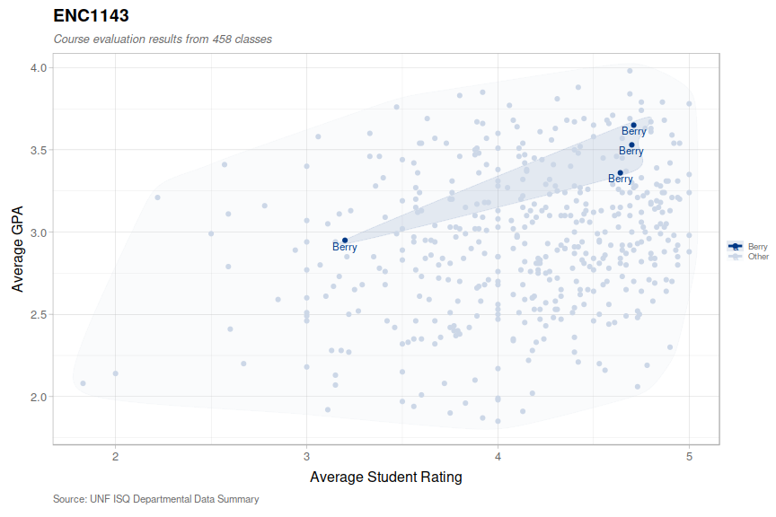

ISQ Plot
================

### Dependencies

Figures are drawn using ggplot2.

``` r
library(ggplot2)
library(ggplot2bdc)
library(ggalt)
library(scales)
library(plyr)
library(dplyr)
```

### Data

This example uses data from Computer Science 1 from 2012-2018, available
at [`data/COP2220.csv`](data/COP2220.csv). The code can be adapted to
use data from any source so long as all the required columns are
satisfied. Check out [ISQool](https://github.com/rothso/isqool) to learn
how to generate CSVs for other UNF courses.

``` r
fileName <- "COP2220"
read_data <- function(fileName) {
  read.csv(paste0("data/", fileName, ".csv")) %>%
    select(course, term, instructor, rating, average_gpa) %>%
    na.omit()
}
df <- read_data(fileName)
```

| course  | term        | instructor | rating | average\_gpa |
| :------ | :---------- | :--------- | -----: | -----------: |
| COP2220 | Spring 2018 | Jethwani   |   3.38 |         2.91 |
| COP2220 | Spring 2018 | Jethwani   |   3.71 |         2.11 |
| COP2220 | Spring 2018 | Liu        |   3.14 |         2.59 |
| COP2220 | Spring 2018 | Jethwani   |   2.86 |         3.15 |
| COP2220 | Spring 2018 | Liu        |   3.16 |         2.92 |
| COP2220 | Spring 2018 | Monsorno   |   2.46 |         2.37 |

Based on the file name, we can determine if the file represents one
course and various professors, like above, or one professor and various
courses. We’re plotting the *feature* that varies (as the other will be
constant).

``` r
add_feature <- function(df, fileName) {
  isProfessor <- startsWith(fileName, "N") && nchar(fileName) == 9
  if(isProfessor) {
    df$feature = df$course
    comment(df$feature) <- "Course"
  } else {
    df$feature = df$instructor
    comment(df$feature) <- "Instructor"
  }
  df
}
df <- add_feature(df, fileName)
```

### Scatter Plot

``` r
ggplot(df, aes(x = rating, y = average_gpa, color = feature)) +
geom_encircle(aes(fill = feature), s_shape = 0.7, expand = 0.02, spread = 0.015, alpha = 0.1) +
geom_text(aes(label = feature), nudge_y = -0.035, size = 3) +
geom_point() +
guides(size = guide_legend(override.aes = list(linetype = 0))) +
labs(
  title = fileName,
  subtitle = paste0("Course evaluation results from ", nrow(df), " classes"),
  caption = "Source: UNF ISQ Departmental Data Summary",
  color = comment(df$feature),
  fill = comment(df$feature),
  x = "Average Student Rating",
  y = "Average GPA"
) +
theme_bdc_grey(grid.x = TRUE, grid.y = TRUE) +
theme(legend.position = "right", legend.direction = "vertical", legend.title.align = 0)
```

<!-- -->

### Focused Scatter Plot

If a plot contains a lot of data (400+ points), it would be nice to
differentiate only those points which we care about. We can highlight a
specific professor we’re interested in by reducing our feature to just
two levels.

``` r
highlight <- "Berry"
df$feature <- ifelse(df$feature == highlight, highlight, "Other")
```

Let’s gray out the other data points and use blue as our accent.

``` r
palette <- c("#003886", "#CCD7E7")
names(palette) <- c(highlight, "Other")
```

We’ll then adjust the `geom_text` to hide superfluous labels and move
the `geom_points` behind the text.

``` r
ggplot(df, aes(rating, average_gpa, color = feature)) +
  geom_encircle(aes(fill = feature), s_shape = 0.7, expand = 0.02, spread = 0.015, alpha = 0.1) +
  geom_point() +
  geom_text(aes(label = ifelse(feature == highlight, highlight, "")), nudge_y = -0.035, size = 3) +
  scale_color_manual(values = palette) +
  scale_fill_manual(values = palette) +
  labs(
    title = fileName,
    subtitle = paste0("Course evaluation results from ", nrow(df), " classes"),
    caption = "Source: UNF ISQ Departmental Data Summary",
    color = comment(df$feature),
    fill = comment(df$feature),
    x = "Average Student Rating",
    y = "Average GPA"
  ) +
  theme_bdc_grey(grid.x = TRUE, grid.y = TRUE) +
  theme(legend.position = "right", legend.direction = "vertical", legend.title.align = 0)
```

<!-- -->

#### Saving to an image

``` r
# Add a plot margin to make it look pretty
last_plot() + theme(plot.margin = margin(2, 2, 2, 2, "cm"))

# Save as a 15 x 8 inch image
ggsave(paste0(fileName, ".png"), width = 14, height = 8, dpi = 100)
```
