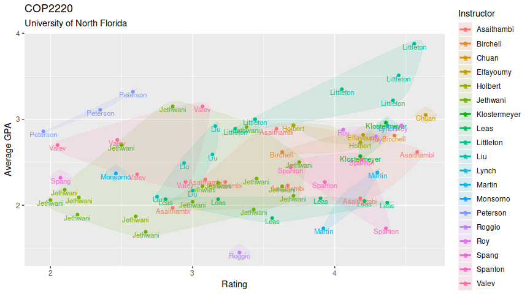

ISQ Plot
================

### Dependencies

Figures are drawn using ggplot2.

``` r
library(ggplot2)
library(ggplot2bdc)
library(ggalt)
library(scales)
library(dplyr)
```

### Data

This example uses data from Computer Science 1 from 2012-2018, available
at [`data/COP2220.csv`](data/COP2220.csv). The code can be adapted to
use data from any source so long as all the required columns are
satisfied. Check out [ISQool](https://github.com/rothso/isqool) to learn
how to generate CSVs for other UNF courses.

``` r
course <- "COP2220"
df <- read.csv(paste0("data/", course, ".csv")) %>%
  select(course, term, instructor, rating, average_gpa) %>%
  na.omit()
```

| course  | term        | instructor | rating | average\_gpa |
| :------ | :---------- | :--------- | -----: | -----------: |
| COP2220 | Spring 2018 | Jethwani   |   3.38 |         2.91 |
| COP2220 | Spring 2018 | Jethwani   |   3.71 |         2.11 |
| COP2220 | Spring 2018 | Liu        |   3.14 |         2.59 |
| COP2220 | Spring 2018 | Jethwani   |   2.86 |         3.15 |
| COP2220 | Spring 2018 | Liu        |   3.16 |         2.92 |
| COP2220 | Spring 2018 | Monsorno   |   2.46 |         2.37 |

Based on the file name, we can determine if the file represents one
course and various professors, like above, or one professor and various
courses. We’re plotting the *feature* that varies (as the other will be
constant).

``` r
if (startsWith(course, "N") && nchar(course) == 9) {
  feature <- "Course"
  df$feature <- df$course
} else {
  feature <- "Instructor"
  df$feature <- df$instructor
}
```

### Scatter Plot

``` r
ggplot(df, aes(x = rating, y = average_gpa, color = feature)) +
  geom_encircle(aes(fill = feature), s_shape = 0.7, expand = 0.02, spread = 0.015, alpha = 0.1) +
  geom_text(aes(label = feature), nudge_y = -0.035, size = 3) +
  geom_point() +
  scale_size_continuous(labels = percent, range = c(1, 2.5)) +
  guides(size = guide_legend(override.aes = list(linetype = 0))) +
  labs(
    title = paste0(course),
    subtitle = paste0("Course evaluation results from ", nrow(df), " classes"),
    caption = "Source: UNF ISQ Departmental Data Summary",
    color = feature,
    fill = feature,
    x = "Average Student Rating",
    y = "Average GPA"
  ) +
  theme_bdc_grey(grid.x = TRUE, grid.y = TRUE) +
  theme(legend.position = "right", legend.direction = "vertical", legend.title.align = 0)
```

<!-- -->

#### Saving to an image

``` r
# Add a plot margin to make it look pretty
last_plot() + theme(plot.margin = margin(2, 2, 2, 2, "cm"))

# Save as a 15 x 8 inch image
ggsave(paste0(course, ".png"), width = 14, height = 8, dpi = 100)
```
