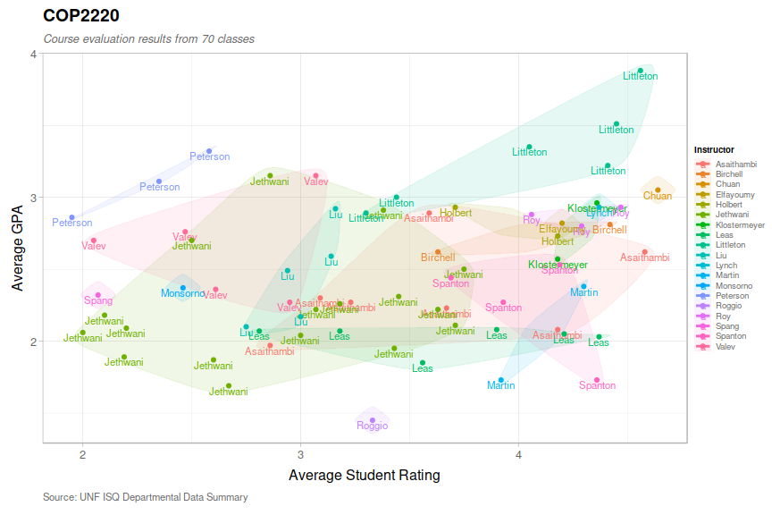

ISQ Plot
================

### Dependencies

Figures are drawn using ggplot2.

``` r
library(ggplot2)
library(ggalt)
library(scales)
library(tidyr)
```

### Data

The necessary columns are:

  - course
  - term
  - instructor
  - rating (numeric)
  - average\_gpa (numeric)

This example uses data from Computer Science 1 from 2012-2018, available
at [`data/COP2220.csv`](data/COP2220.csv). The code can be adapted to
use data from any source so long as all the required columns are
satisfied. Check out [ISQool](https://github.com/rothso/isqool) to learn
how to generate CSVs for other UNF courses.

``` r
course <- "COP2220"
df <- read.csv(paste0("data/", course, ".csv")) %>%
  drop_na("course", "term", "instructor", "rating", "average_gpa")
```

Based on the file name, we can determine if the file represents one
course and various professors or one professor and various courses. The
*feature* we’re plotting is whichever one varies (as the other will be
constant).

``` r
if (startsWith(course, "N") && nchar(course) == 9) {
  feature <- "Course"
  df$feature <- df$course
} else {
  feature <- "Instructor"
  df$feature <- df$instructor
}
```

### Scatter Plot

``` r
ggplot(df, aes(x = rating, y = average_gpa, color = feature)) +
  geom_encircle(aes(fill = feature), s_shape = 0.7, expand = 0.02, spread = 0.015, alpha = 0.1) +
  geom_text(aes(label = feature), nudge_y = -0.035, size = 3) +
  geom_point() +
  scale_size_continuous(labels = percent, range = c(1, 2.5)) +
  guides(size = guide_legend(override.aes = list(linetype = 0))) +
  labs(
    title = course,
    subtitle = "University of North Florida",
    color = feature,
    fill = feature,
    x = "Rating",
    y = "Average GPA"
  )
```

<!-- -->

#### Saving to an image

``` r
# Add a plot margin to make it look pretty
last_plot() + theme(plot.margin = margin(2, 2, 2, 2, "cm"))
ggsave(
  paste0(course, ".png"),
  width = 15,
  height = 8,
  dpi = 100
)
```
